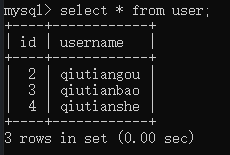
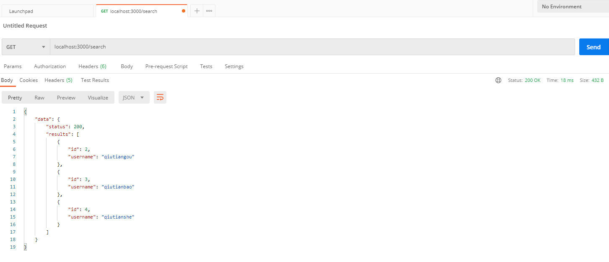
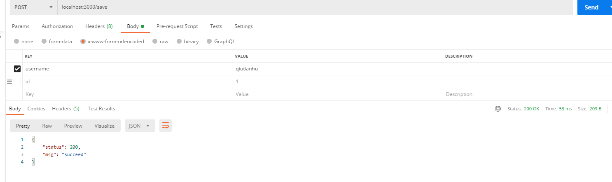
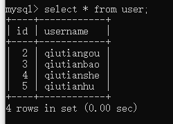
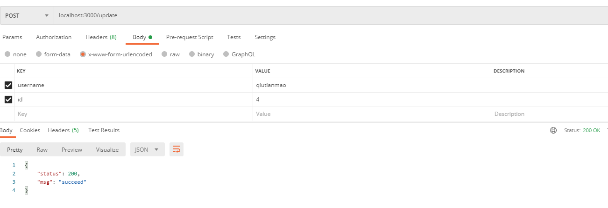
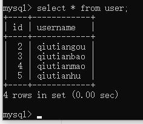
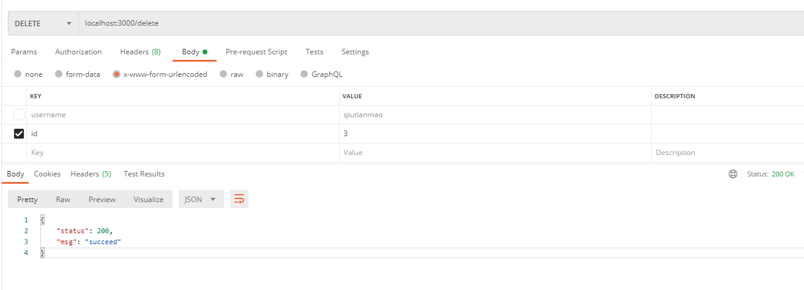
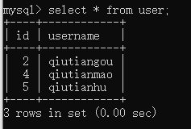

# koa2 + mysql CURD
## description:
    this repo is a simple curd demo.

## usage:
### requirements:
- npm install
- npm install mysql --save

### demo db table:
​	id  |  username

### run:
- npm start curd

## test curd with POSTMAN:

### 1 init table:

### 2 Retrieve:

### 3 Insert "qiutianhu" into table:

### 4 Update "qiutianshe" to "qiutianmao":

### 5 Delete "qiutianbao":

